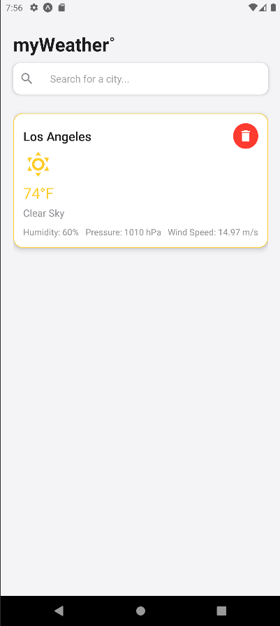
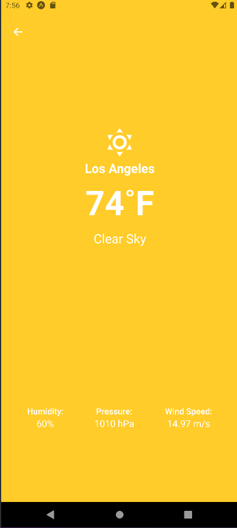

# myWeather˚ App

Welcome to **myWeather˚**, a beautifully designed and simple weather app that allows you to check the current weather conditions in your city with ease. Featuring a clean user interface with a sleek gradient background and weather-themed icons, myWeather˚ is the perfect tool for getting instant weather updates in a visually appealing format.

## Features

- **Real-Time Weather Information**: Get accurate weather updates for your city.
- **Dynamic UI**: Weather entries are dynamically updated based on weather conditions. For example, if the weather is cloudy, the component and page will feature a cloudy grey background.
- **Mobile-Friendly Layout**: Designed for both Android and iOS devices, ensuring compatibility and responsiveness on various screen sizes.
- **Search Auto-Complete**: Takes a list of the most popular US cities and auto-completes them on user search.

## Screenshots

<p>



</p>

## Tech Stack & Libraries

- **Open Weather API**: Fetches real-time weather data based on user city input.
- **React Native**: The app is built using [React Native](https://reactnative.dev/), providing a cross-platform mobile development framework.
- **Expo**: Utilized for easy development, testing, and deployment of the app. Expo provides built-in tools like icons and gradient effects.
- **Expo Linear Gradient**: For the smooth white-to-blue gradient background.
  - [expo-linear-gradient](https://docs.expo.dev/versions/latest/sdk/linear-gradient/)
- **Expo Icons**: The app uses [MaterialCommunityIcons](https://icons.expo.fyi/MaterialCommunityIcons) from the Expo library for weather-themed icons.
- **React Navigation**: Enables smooth navigation between screens.
  - [react-navigation/native](https://reactnavigation.org/)

## Installation

1. **Clone the repository:**
   ```bash
   git clone https://github.com/kepegram/myWeather.git
   npm install
   npm run android
   or
   npm run ios
   ```
